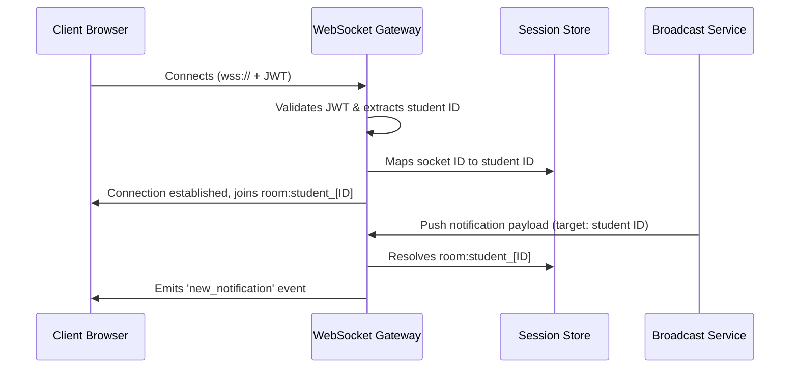
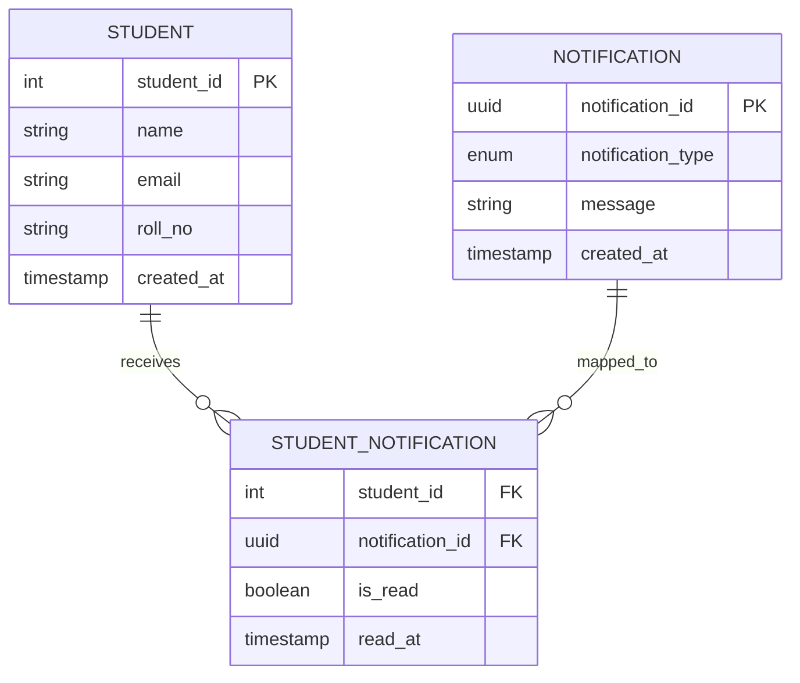
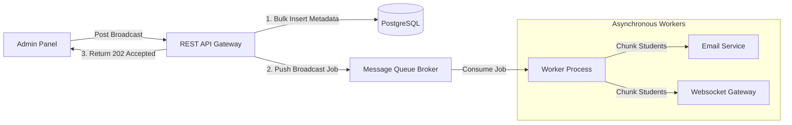

# Campus Notifications System Architecture Design

This document details the engineering design and architecture of the microservice responsible for dispatching, caching, and ranking campus-wide notifications.

---

## 1. API Contract & Live Communication

### REST Endpoint Contracts

The microservice exposes three main REST endpoints to client applications:

#### Fetch Student Notifications (`GET /api/v1/notifications`)

Retrieves a paginated list of notifications for the authenticated student.

- **Headers Required:** `Authorization: Bearer <token>`
- **Query Parameters:**
  - `page` (default: 1)
  - `limit` (default: 15)
  - `type` (filter by `Placement`, `Event`, or `Result`)
  - `isRead` (filter by `true` or `false`)
- **Success Response (200 OK):**
  ```json
  {
    "success": true,
    "notifications": [
      {
        "id": "b283218f-ea5a-4b7c-93a9-1f2f240d64b0",
        "type": "Placement",
        "message": "CSX Corporation hiring announcements",
        "timestamp": "2026-06-25T14:14:02Z",
        "isRead": false
      }
    ],
    "pagination": {
      "currentPage": 1,
      "totalPages": 12,
      "totalItems": 178
    }
  }
  ```

#### Mark Individual Notification as Read (`PATCH /api/v1/notifications/:id/read`)

Marks a single notification as read for the logged-in student.

- **Success Response (200 OK):**
  ```json
  {
    "success": true,
    "id": "b283218f-ea5a-4b7c-93a9-1f2f240d64b0",
    "isRead": true
  }
  ```

#### Bulk Mark All Notifications as Read (`POST /api/v1/notifications/read-all`)

Marks all outstanding unread notifications for the student as read.

- **Success Response (200 OK):**
  ```json
  {
    "success": true,
    "updatedCount": 14
  }
  ```

---

### Real-Time Delivery Loop

Instead of making clients poll the server, we use a WebSocket connection via Socket.io:



---

## 2. Storage Setup & Database DDL

### Relational Database Selection

For the primary persistent database, we selected **PostgreSQL** paired with an in-memory **Redis** cache.
A relational database is selected because:

- **Foreign Key Integrity:** We must enforce strict relationships between notifications, student records, batches, and courses to prevent orphan records.
- **Transaction Safety (ACID):** Sensitive notifications (like financial holds, fee deadlines, or exam results) must be committed atomically.
- **Structured Indexes:** PostgreSQL supports rich composite indexing and partial indexes, which are essential for sorting and pagination query optimization.

### Database DDL Schema



```sql
CREATE TYPE notification_type AS ENUM ('Event', 'Result', 'Placement');

CREATE TABLE students (
    student_id SERIAL PRIMARY KEY,
    name VARCHAR(100) NOT NULL,
    email VARCHAR(150) UNIQUE NOT NULL,
    roll_no VARCHAR(20) UNIQUE NOT NULL,
    created_at TIMESTAMP WITH TIME ZONE DEFAULT CURRENT_TIMESTAMP
);

CREATE TABLE notifications (
    notification_id UUID PRIMARY KEY DEFAULT gen_random_uuid(),
    notification_type notification_type NOT NULL,
    message VARCHAR(255) NOT NULL,
    created_at TIMESTAMP WITH TIME ZONE DEFAULT CURRENT_TIMESTAMP
);

CREATE TABLE student_notifications (
    student_id INT REFERENCES students(student_id) ON DELETE CASCADE,
    notification_id UUID REFERENCES notifications(notification_id) ON DELETE CASCADE,
    is_read BOOLEAN DEFAULT FALSE NOT NULL,
    read_at TIMESTAMP WITH TIME ZONE,
    PRIMARY KEY (student_id, notification_id)
);
```

### High-Volume Scaling Strategies

To support millions of rows, we implement:

1.  **Horizontal Table Partitioning:** Partitioning the `student_notifications` table by monthly range on the `created_at` timestamp. This allows us to keep active alerts in memory/SSDs and archive older partitions to cold storage.
2.  **Partial Indexing:** Since unread notifications represent a tiny, fast-changing subset of the table, we create a targeted index:
    ```sql
    CREATE INDEX idx_student_unread_notifications
    ON student_notifications(student_id)
    WHERE is_read = FALSE;
    ```

### Core Operations SQL Queries

- **Fetch Unread Notifications (Paginated):**
  ```sql
  SELECT n.notification_id, n.notification_type, n.message, n.created_at, sn.is_read
  FROM student_notifications sn
  JOIN notifications n ON sn.notification_id = n.notification_id
  WHERE sn.student_id = 1042 AND sn.is_read = FALSE
  ORDER BY n.created_at DESC
  LIMIT 15 OFFSET 0;
  ```
- **Mark Notification as Read:**
  ```sql
  UPDATE student_notifications
  SET is_read = TRUE, read_at = NOW()
  WHERE student_id = 1042 AND notification_id = 'b283218f-ea5a-4b7c-93a9-1f2f240d64b0';
  ```

---

## 3. Query Analysis & Index Optimization

### Relational Fetch Query Analysis

Let's analyze the following query at scale:

```sql
SELECT * FROM notifications
WHERE studentID = 1042 AND isRead = false
ORDER BY createdAt DESC;
```

#### Performance Bottlenecks at Scale

With 50,000 students and over 5,000,000 records, this query will degrade severely:

1.  **Full Table Scans:** Without indexes, the query engine scans every record in the table sequentially, causing high CPU usage and disk I/O.
2.  **Expensive Sorting:** Sorting the matched results by `createdAt DESC` on the fly requires an in-memory or temporary disk-based file sort.

#### Recommended Composite Index

```sql
CREATE INDEX idx_student_unread_created
ON notifications(studentID, isRead, createdAt DESC);
```

- **Cost Before Index:** $O(N)$ sequential table scan.
- **Cost After Index:** $O(\log N + K)$ index seek, where $K$ is the small matching subset size. Because the index stores the records pre-sorted by `createdAt DESC`, the sorting cost becomes $O(0)$.

#### Critiquing the "Index Every Column" Approach

Adding an index to every single column is a classic anti-pattern:

- **Write Degradation:** Every write, update, and delete triggers synchronous index updates, reducing insert performance.
- **Index Bloat:** Indexes occupy memory. If indexes exceed RAM capacity, the system suffers from heavy disk-thrashing.
- **Inefficiency:** The query optimizer typically utilizes only one index per table access for a query, rendering other individual indexes unused.

#### Weekly Announcement Analytics Query

```sql
SELECT DISTINCT studentID
FROM notifications
WHERE notificationType = 'Placement'
  AND createdAt >= NOW() - INTERVAL '7 days';
```

---

## 4. Multi-Layer Caching Design

To scale reads and offload database pressure, we utilize three complementary caching layers:

### Caching Strategy Evaluation

- **Cache-Aside (Redis Key-Value):**
  Stores serialized unread JSON arrays under `student:1042:unread`.
  - _Trade-offs:_ High write overhead during status updates (requires invalidation), but keeps reads at sub-millisecond latencies.
  - _Consistency:_ Eventual consistency with short TTLs (e.g. 5 minutes) as backup.
- **In-Memory Sorted Sets (Redis ZSET):**
  Maintains the top 10 items directly in Redis where the score is the item's priority.
  - _Trade-offs:_ Consumes more Redis memory but provides ultra-fast retrieval ($O(\log M + K)$) and direct sorting.
  - _Consistency:_ Strong consistency via atomic updates during writes.
- **Conditional HTTP Cache (ETags):**
  Generates a state hash header of the unread list. Clients pass this in `If-None-Match`.
  - _Trade-offs:_ Eliminates network payload on matches by returning a `304 Not Modified` response.
  - _Consistency:_ Strong consistency checked by the server gateway.

---

## 5. Scalable Broadcast Queue Architecture

### Problems with Synchronous Loops

Iterating over a list of 50,000 students to send notifications inline within an API controller causes:

- **Event Loop Blockage:** The thread blocks while waiting for network requests to complete, leading to timeouts.
- **No Error Resilience:** A network failure midway aborts the process, leading to partially-notified states.
- **Connection Starvation:** Firing thousands of concurrent DB writes saturates the connection pool.

### Message Queue Solution

We use a publisher-subscriber model with a message broker (like BullMQ or RabbitMQ) to decouple requests from execution:



### Redesigned Broadcast Implementation (Python Pseudocode)

```python
import queue_client

def notify_all(student_ids: array, message: string):
    # Step 1: Save the notification metadata once
    global_notification_id = db.insert_notification_meta(
        message=message,
        type="Placement"
    )

    # Step 2: Bulk insert unread associations for all students
    db.bulk_insert_student_notifications(
        notification_id=global_notification_id,
        student_ids=student_ids
    )

    # Step 3: Offload execution task to the queue broker
    queue_client.publish("broadcast_notifications", {
        "notification_id": global_notification_id,
        "student_ids": student_ids,
        "message": message
    })

    return {"status": "processing", "job_id": global_notification_id}

# --- Background Worker Process ---
def process_broadcast_worker(job):
    # Batch students in chunks of 500 for network efficiency
    batches = chunk_array(job.student_ids, 500)
    for batch in batches:
        queue_client.publish_bulk("email_dispatch_queue", [
            {"student_id": sid, "message": job.message} for sid in batch
        ])
        queue_client.publish_bulk("websocket_push_queue", [
            {"student_id": sid, "message": job.message} for sid in batch
        ])
```

---

## 6. Priority Inbox Algorithm

The Priority Inbox organizes incoming announcements by ranking them dynamically.

### Ranking Scoring Formula

The score balances categorical weight and recency:
$$\text{Priority Score} = (\text{Weight} \times 10^{13}) + \text{Timestamp}$$

> [!NOTE]
> Using the timestamp directly as the secondary factor ensures that for notifications of the same type, newer ones always rank higher. Multiplying the weight by a large scale factor ($10^{13}$) ensures that `Placement` notices always outrank `Result` updates, which in turn outrank `Event` notices, regardless of their timestamps.

### High-Throughput Stream Maintenance

- **In-Memory Min-Heap:** On the backend application node, we maintain a Min-Heap of size 10. When a new notification is fetched, we compare its score to the root element. If the new item has a higher score, we replace the root and run heapify down, keeping the complexity at $O(\log 10) \approx O(1)$.
- **Distributed Redis Sorted Sets:** We use a `ZSET` structure. When a new alert is pushed, we write it to the sorted set with the priority score, then immediately trim the set to keep only the top 10 elements:
  ```redis
  ZADD student:1042:priority <score> <notification_payload>
  ZREMRANGEBYRANK student:1042:priority 0 -11
  ```
  This ensures that fetching the student's top-10 inbox remains a constant time $O(1)$ database query.
